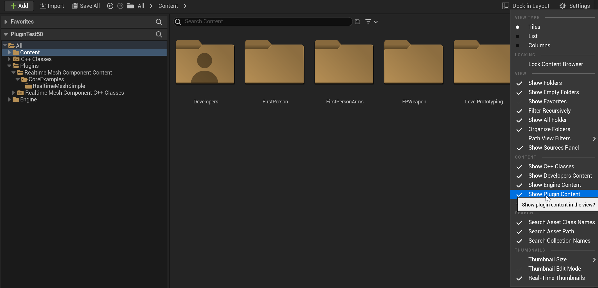

+++
title = "Examples"
weight = 3
+++

The example content is now contained within the plugin itself, within several Blueprints for different examples, or from a separate code module in the plugin `RealtimeMeshComponentExamples` that serve to demonstrate different concepts.

Make sure plugin content is visible in the content browser, if not you can enable it through `Settings -> Enable Plugin Content`

