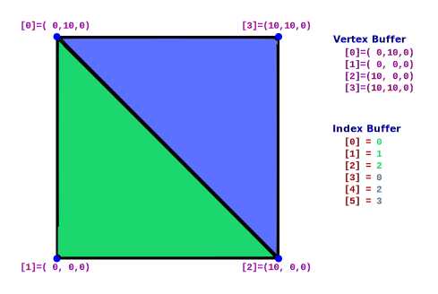

+++
title = "Meshes"
weight = 1
+++

## Mesh Representation

Mesh data in the Realtime Mesh Comonent is represented as a indexed triangle list. With this you have two buffers:

1. **Vertex Buffer**: Responsible for storing all the unique vertices. This is done ideally without duplicates, but also a single attribute being different causes the whole vertex to be different. 
   The normal vertex attributes are:
    1. **Position**: Represents the position of the vertex in object space as a three component vector for X, Y, Z
    2. **Normal**: Represents the up-vector of the face this vertex is responsible for, or the common up-vector used for smooth shading all the adjoining triangle faces. Also known as Tangent-Z
    3. **Tangent**: Represents the forward-vector of the face this vertex is responsible for, or the common forward-vector for smooth shading all the adjoining triangle faces. Also known as Tangent-X
    4. **UV Coorinates 1-8**: Also konwn as Texture Coorinates, are the 2D coordinats in texture space 0-1 representing the area of a texture to apply to this face at this vertex. There can be any number of these channels between 1 and 8. Can also be used to feed arbitrary data through to the shader and sample in Material as TextureCoordinate.
    5. **Color**: Also known as Vertex Color is the color channel that can be used for supplying a color for this vertex, or possibly some other arbitrary data through to the material and read in the material as Vertex Color
   
2. **Index Buffer**: Responsible for storing the mapping of vertices to triangles. Formed by a list of integers, with each group of 3 representing a triangle, and indexing the vertices to use for that triangles points.

The example below shows a simple setup where we render two triangles, using 6 entries in the index buffer, and only 4 vertices since 2 vertices are shared with two triangles each on the common edge.

---

## Winding Order

One thing to be aware of and careful of is the order of your triangles indices. This affects one standard optimization of 3d rendering called backface culling. Unreal Engine uses Counter Clockwise Culling, so if the triangles points are visually ordered clockwise as referenced in the index list, it will not be rendered. This is a standard and important optimization as it removes many triangles that cannot be visible as they're facing away from the view.

This means when you index your vertices, you should index the points visually counter clockwise.

---

## Advanced Indexing

There are advanced things you can do with index buffers, in combinaton with the section groups/sections of the RMC, for example:
* You could make one large index buffer and have a separate index buffer for shadows to simplify the geometry used. This can be extremely beneficial as shadows do not care about anything except position, so you could combine duplicates much more aggressively
* You could make different versions of a sections that share a common set of vertices and switch between which one is rendered.

---

## Additional Resources

* More info on triangle primitives (Specifically GL_TRIANGLES):

    https://www.khronos.org/opengl/wiki/Primitive#Triangle_primitives

* You can find more info on winding order and face culling here:

    https://www.khronos.org/opengl/wiki/Face_Culling